<h1 align="center">Hi, I'm Afraz 👋</h1>

  <b>Senior Data Scientist</b> · Machine Learning · Geospatial ML · Applied Research

  
  

---

### About me

- 🔭 Currently working on **Geospatial Machine Learning**
- 🌱 Currently learning **Graph Neural Networks (GNNs)**
- 👯 Looking to collaborate on **Machine Learning projects**
- 🤔 Looking for help understanding **GNNs** — reach out if this is your area!
- 💬 Ask me about my **repositories** and applied ML work
- ⚡ Fun fact: I built my own PC for fun

---

### 🛠️ Languages & Tools

**Languages**

**ML / Deep Learning**

**Data & Infrastructure**

---

### 📊 GitHub Stats

  

---

  📫 <b>Reach me on <a href="https://www.linkedin.com/in/afrazarifkhan/">LinkedIn</a></b>

